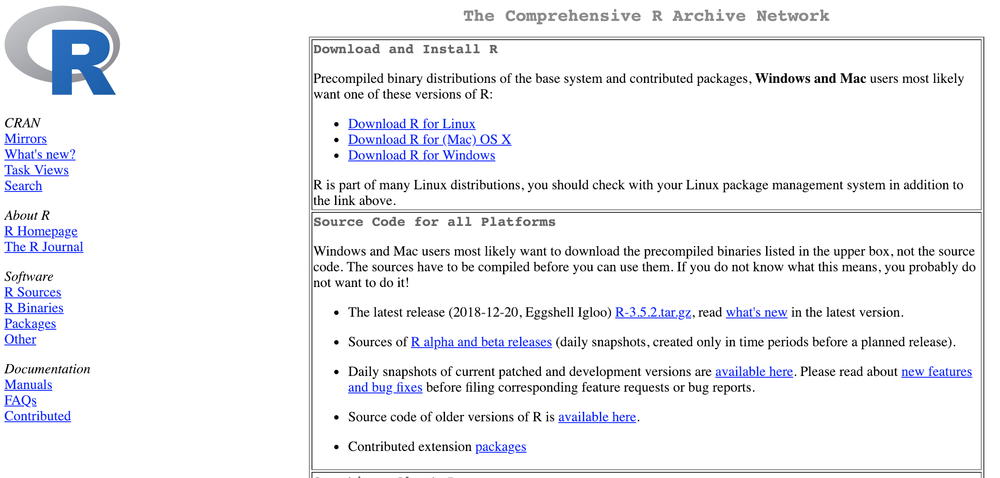
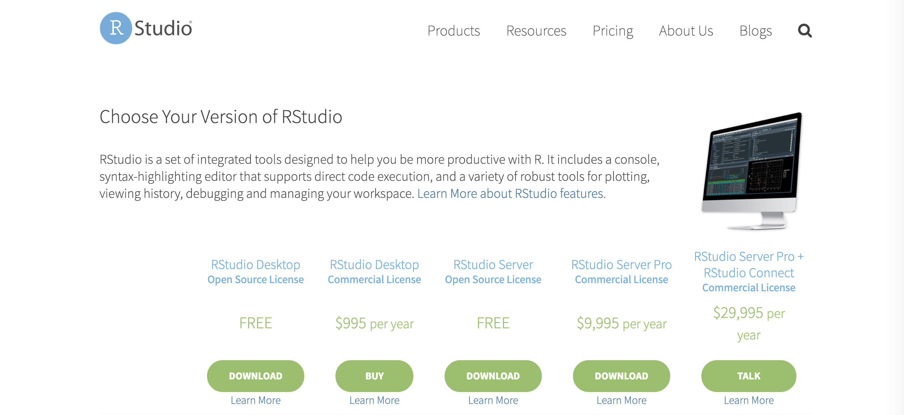
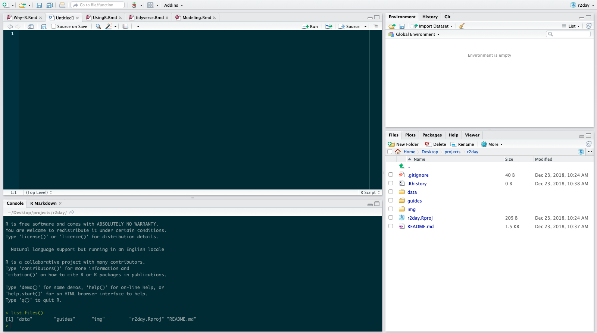

## R, RStudio, and Tidyverse

### R

You can download R for your computer by going to [CRAN](https://cran.r-project.org/) and selecting the appropriate ```Download and Install R``` links.

> Make sure to install R first before installing RStudio.



### RStudio 

[RStudio](https://www.rstudio.com/products/rstudio/download/) is an integrated development environment (IDE) for R^[https://www.rstudio.com/products/RStudio/].
RStudio is basically your workbench where you can access everything you need for managing your scripts, data, and project structure.
By using RStudio, you also can use a host of other features ranging from Markdown documents (like this one!), interactive data dashboards like [Shiny](https://www.rstudio.com/products/shiny/), and the [tidyverse](https://www.rstudio.com/products/rpackages/).




### rproj 

One thing that I will introduce now, but not talk much about is the `.rproj` file.
What this little file does (you can open it up as a text file and see how little it is) is bascially wall off your directory from everything else on your computer so you don't have to write obnoxiously long absolute paths.
They make it easier for your work to run on other's computers. 

### Packages and the tidyverse

What makes R different than programs like Excel or SPSS is that R as you download it does not come with everything installed.
Downloading R from CRAN gives you what is referred to as **base R**.
The idea is that since you do not need all the software, all the time, you just load in what you need.
R can be used just by itself, but the real advantage of it is that so many people use it and write software for it, if there is something that you need to do that is somewhat common, chances are that someone has written software for it already.
The external software that you load in are referred to as **packages** which are kept in your **library**.
Some packages are very small and simple, others have extensive teams developing them.
One of the most important packages in R is the tidyverse.

The [tidyverse](https://www.tidyverse.org/) is a collection of packages that were developed to make manipulating data more intuitive.
As noted on its homepage, 

> All packages share an underlying design philophy, grammar, and data structures.

While this might seem trivial now, having your data be ```tidy``` opens up an entire world of data manipulation and modeling.
Once you you get over the initial learning curve of R, the tidyverse makes it so that you can pretty much take off and learn very q quickly.

## RStudio Environment

Once you now have R and RStudio installed, it's time to open up RStudio.
By opening RStudio, you are also starting R.
R will be running under the hood of RStudio.
After installing R, you can run it on it's own by typing ```R``` into your terminal on a Unix machine (Mac, Linux).
Though after seeing how RStudio works, you would realize why doing this is basically masochistic.
(If you do this, you can quit out of the terminal R with ```quit()``` followed by ```n```).

When you first open RStudio will see a few different panels.
In it's default settings, the bottom left is the Console.
The top right has your Environment, History, and version control commands.
The bottom right has your Viewer, Library for your packages, and a system to navigate your files.
The top left will be where you write your code. 



### Environment

The top left has information about your current Environment.
As you make new things in an R session you can track them here.
There is also a History tab here that keeps track of code you wrote.
Additionally there is a Git tab that will eventually allow you to do version control.
You don't have to know what that is, but one day you might read about it.

### Viewer

The bottom right is your File Explorer/Finder window.
Try to click around on the **Files** tab.
When you click **Plots** there should be nothing there as you have not made any plots yet.
Your **Packages** tab will have a listing of software that you can load into R.
Notice that if you click one of the package names, it will navigate you to the **Help** tab.
Lastly, the Viewer tab will let you display any documents that you make while writing in R.
This could be markdown documents or maybe a website that you are writing eventually.

> It is important to note that you will probably "break" R and RStudio many times when learning. Know that this is OK and the some of the best advice for learning how to program is by just seeing what happens when you change something and Googling your problems.


### An Example

Just so we get a bit of practice _doing_ something in R, let's import a dataset, then save it after making small modification to it. 
It's not super important you get the syntax quite yet, that will come next lesson!

Imagine your colleagues is teaching a lesson with the `tips.csv` dataset to group of students from different countries (England, Japan, India) who are about to take their first visit to the USA.
To get them used to the idea of how much they are expected to tip their servers, we need to make new columns that convert the USD column to pounds, yen, and Australian dollars.

Note we're going to do this the `tidyverse` way, which will be the focus of this short course! 


```{r}
library(tidyverse)

tips <- read_csv("tips.csv")

converted_tips <- tips %>% 
  select(-X1) %>% 
  mutate(gbp_total= total_bill * 0.81) %>%
  mutate(gbp_tips = tip * 0.81) %>%
  mutate(yen_total = total_bill * 106) %>%
  mutate(yen_tips = tip * 106) %>%
  mutate(aus_total = total_bill * 0.64) %>%
  mutate(aus_tips = tip * 0.64)

# Vectorization 
tips$total_bill
tips$total_bill * 0.81

write_csv(converted_tips, "converted_tips.csv")

```

